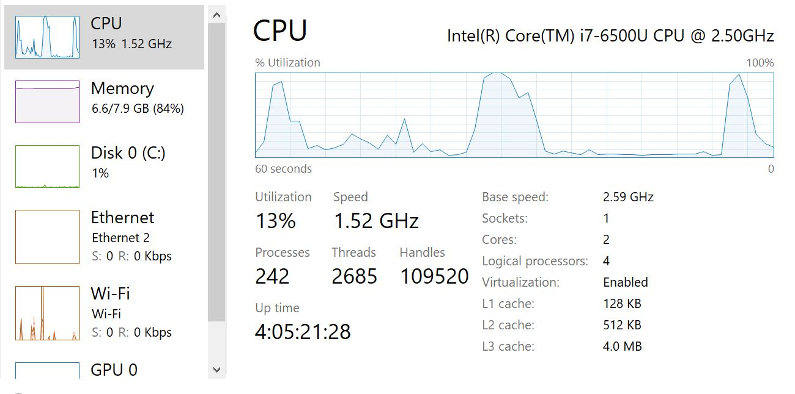
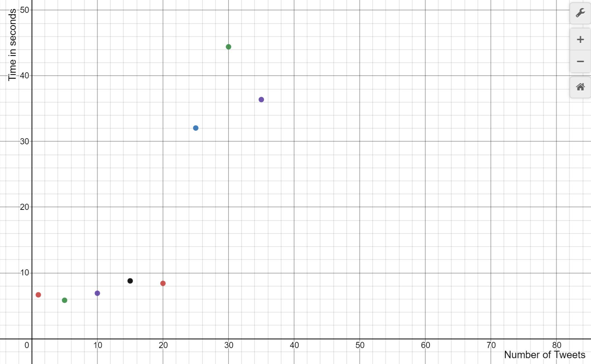

# video-brianhe12
Created a module that generates a daily video summarzing a twitter handle day. This is done by converting text into an image in a frame, sequencing the images in chronological order, and then using ffmpeg to convert each image into a three second video.

## Built with:

[Tweepy](http://docs.tweepy.org/en/latest/#)

[Ffmpeg](https://www.ffmpeg.org/)

## Try it Out!
Clone this repository and authenticate with [Tweepy](http://docs.tweepy.org/en/latest/#). You will also need to install [Ffmpeg](https://www.ffmpeg.org/) locally.

### Tweepy 
For [Tweepy](http://docs.tweepy.org/en/latest/#), you will need to create a 'keys.py' file with your own generated keys for authentication. 

```python
# keys.py
CONSUMER_KEY = "********"
CONSUMER_SECRET = "********"

ACCESS_TOKEN = "********"
ACCESS_TOKEN_SECRET = "********"
```

## Example Usage
```
PS C:\..\video-brianhe12> python .\ffmpeg_proj.py
```
The program will ask for user inputs such as Twitter Handle and Number of top tweets the user wants to grab. After inputing valid inputs, a ```mergedfile.mp4``` result will be generated in the current directory.

## CPU Utilization



Each CPU core can have two threads. Running this program on a dual core CPU, we encounter certain bottlenecks when we try to query more than 20 tweets and convert each of them into a three second frame for our video. The average time it takes for the program to finish executing when the number of tweets is less than or equal to 20 is less than 10 seconds. Trying to query any more tweets may take atleast 3x more time. When we reach the bottleneck for our resources, it would not be uncommon for CPU utilization rates to drop to 0 and stay for 20 seconds as depicted in the image above.


